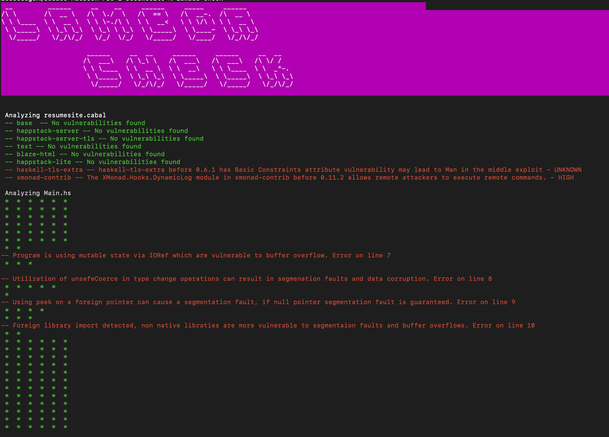

    
2024

    

<!DOCTYPE html>
<html lang="en">
<head>
    <meta charset="UTF-8">
    <meta name="viewport" content="width=device-width, initial-scale=1.0">
    <!-- Include Tailwind CSS -->
    <link href="https://cdn.jsdelivr.net/npm/tailwindcss@2.2.19/dist/tailwind.min.css" rel="stylesheet">
</head>
<body class="bg-slate-500>

    

        <h1 class="text-3xl font-bold text-center uppercase text-purple-900">Lambda Check</h1>
    

    

        
a Haskell audit security tool 🛡️ that...

    

    

        
Finds security vulnerabilities ✅

        
Flags potential segmentation faults  ✅

        
Identifies unsafe thread practices ✅

    

    

        
Categories: 

         
        
We felt that the Bank of America - Financial Hack category presented us with the opprotunity to tackle an ever present and relevant issue in software, that issue being security.

         
        
Many popular languages (i.e. JavaScript, Rust, Go, etc...) have audit tools to perform security checks, Haskell does not. Our goal for HenHacks 2024 was to create a continuous integration security audit tool that gives Haskell developers the ability to analize the integrity of their programs! 😄
        

         
        

        Our tool offers developers the ability to check their third party package vulnerabilities, their program's thread safety and their program's memory/buffer overflow. ✨
        

    

    

        <ul class='bg-gray-200 p-4 '>
            
Features 🍩:

            

                <li>CLI tool (lambda-check) </li>
                <li>Up to date CVE's<l/i>
                <li>Error line numbers</li>
                <li>Checks all .cabal & .hs files</li>
                <li>File by file output</li>
                <li>Colored output</li>
            

        </ul>
        <ul class='bg-gray-200 p-4 '>
            
Technology used 🤓:

            

                <li>Haskell</li>
                <li>Python</li>
                <li>FastAPI</li>
                <li>SQLite</li>
                <li>Rest API</li>
            

        </ul>
    

    

        
Screenshots 📸:
        
    

</body>
</html>
